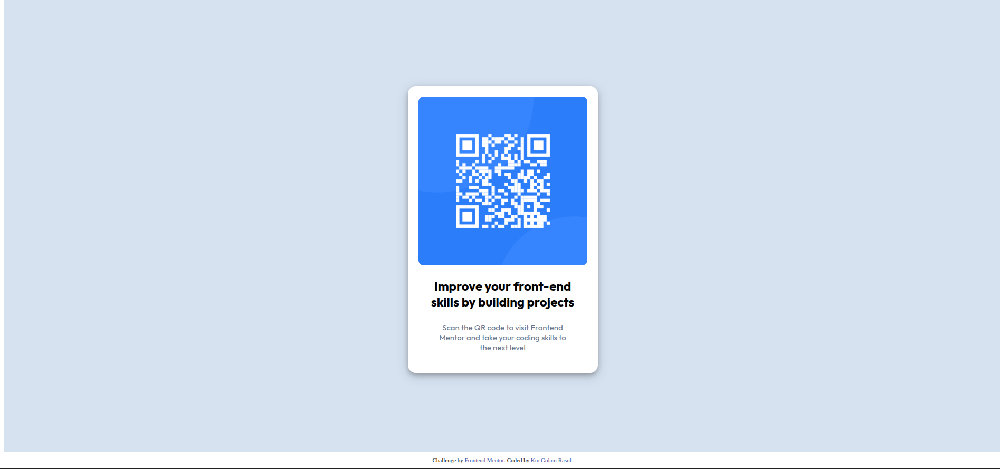

# Frontend Mentor - QR code component solution

This is a solution to the [QR code component challenge on Frontend Mentor](https://www.frontendmentor.io/challenges/qr-code-component-iux_sIO_H). Frontend Mentor challenges help you improve your coding skills by building realistic projects. 

## Table of contents

- [Overview](#overview)
  - [Screenshot](#screenshot)
  - [Links](#links)
- [My process](#my-process)
  - [Built with](#built-with)
  - [What I learned](#what-i-learned)
  - [Continued development](#continued-development)
  - [Useful resources](#useful-resources)
- [Author](#author)


## Overview
This is a solution to the [QR code component challenge on Frontend Mentor](https://www.frontendmentor.io/challenges/qr-code-component-iux_sIO_H)
### Screenshot



### Links

- Solution URL: [Add solution URL here](https://your-solution-url.com)
- Live Site URL: [Add live site URL here](https://your-live-site-url.com)

## My process

- Outlined the container first.
- Worked my way from the inside to outside inorder to match the padding, margin and the viewport height to match the container.
- Added the QR Code screenshot then adjusted accordingly.
- Added box-shadow for the finishing touch.

### Built with

- Semantic HTML5 markup
- CSS custom properties
- Flexbox

### What I learned

I got to explore through new resources and got a better understanding of flexbox and grids.

For flexbox,
There are two axis. Which are, cross and main axis.

In my mind, I labeled them as X & Y axis like in the cartesian coordinates.

For the main (X) axis,
*justify-content* is used to organise the divs/containers accordingly.
For the cross (Y) axis,
*align-items* is used to organise the containers
*align-content* is used to organise the rows inside the flexbox

This is more or less simplified, and using their values (eg. flex-end, flex-start, etc..) will change their spacing accordingly.

For grids,
It's more like the ```<tr> <td>``` tags from HTML.
That's how I perceive CSS grids as.
It' not completely like the table row tags from HTML, but there's some similarities in it.

### Continued development

I will continue to focus on CSS layouts, designs and responsiveness, as well as the backends, so I can grasp a better understanding of creating a functional app or website.

### Useful resources

- [resource 1](https://flexboxfroggy.com/) - This helped me practice and understand CSS Flexbox in depth. I really liked how they gamified learning CSS which helped me progress much quicker.
- [resource 2](https://codepip.com/games/grid-garden/) - This is similar to flexboxfroggy, except it's for CSS grids. As before, it's also gamified and they have really good practices to get better at grids.
- [resource 3](https://www.w3schools.com/css/css3_shadows_box.asp) - Used the example boxshadow to add the finishing touches to the solution.

## Author

- Frontend Mentor - [@kmgolamrasul](https://www.frontendmentor.io/profile/KmGolamRasul)
- GitHub - [@kmgolamrasul](https://github.com/kmgolamrasul)

